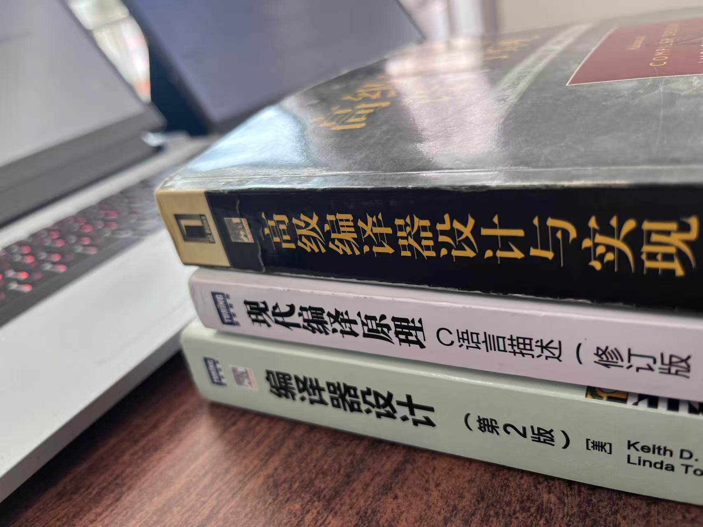

## 前言
- 参考资料以`鲸书` + llvm 文档为主, `虎书`, `橡书`为辅, `crafting interpreters` 为前置.
    - `crafting interpreters`: 实现两个解释器, 让你知体会编译原理大致是什么样, 做起来有成就感
    - `虎书`, `橡书`中级书籍, 全面的讲解编译原理, 理论知识讲解详细, 不过优化, 后端部分不如`鲸书`全面, 深入.
    - `鲸书`深入优化, 从四大分析(`控制流分析`, `数据流分析`, `依赖关系分析`, `别名分析`)的理论基石到各种优化案例, 结合 llvm 中的实现体会.
- 鲸书的第七章`控制流分析`, 第八章`数据流分析`, 第九章`依赖关系分析`, 第十章`别名分析`看懂后在来看具体的优化例子. 这四种分析构成了编译优化的 “基石”, `鲸书`更贴合工业生产, 更加复杂, `虎书`, `橡书`中相对简单一些, 可以三本书结合着看.
- 建议食用路线是: 四大分析(循环分析, 数据流分析, 别名分析, 依赖分析), 算是根基, 然后再看这种优化案例(死代码去除, 活跃变量分析, 循环外提, 寄存器分配, 复写传播...), 对照 llvm 的实现看

## 站在巨人的肩膀上
