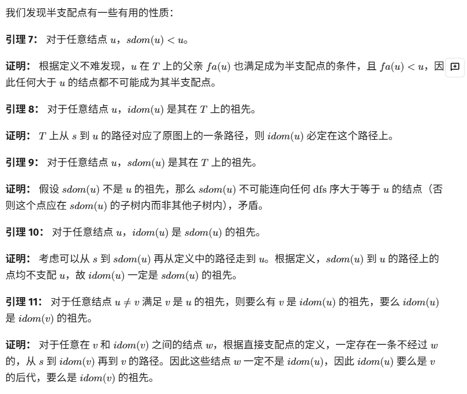
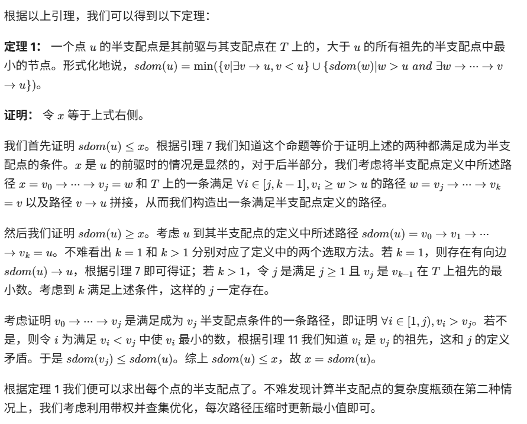
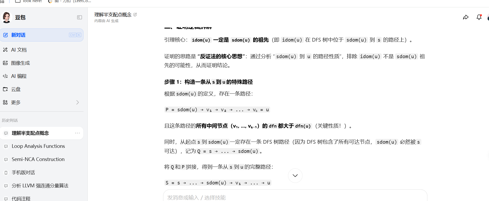
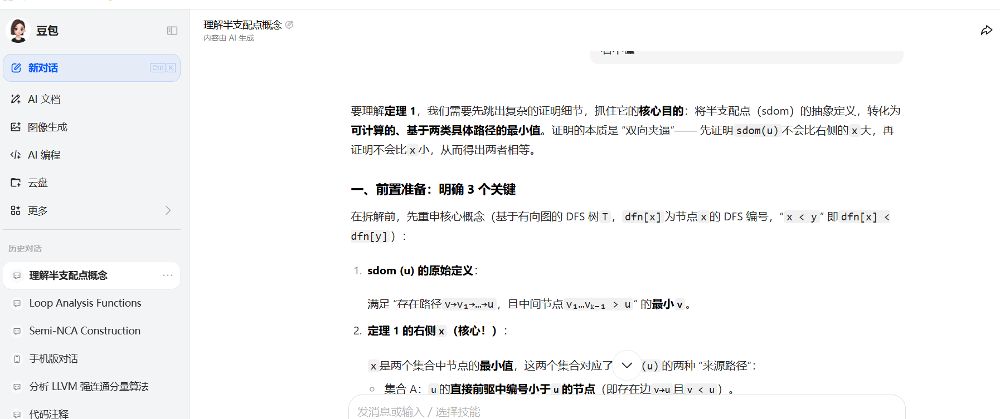
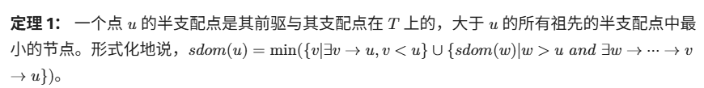
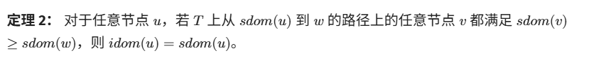
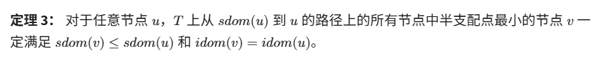
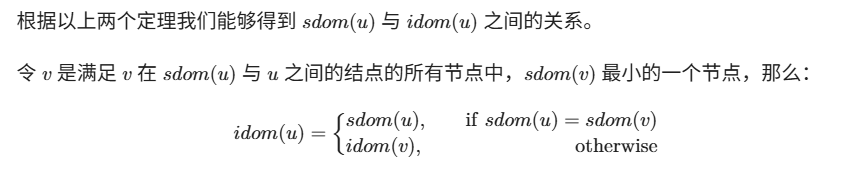

## 简介
支配树是一个重要的结构, 在鲸书, 虎书, 橡书中皆有讲解. 涉及到了很多概念: 支配, 必经节点, 直接必经节点, 严格必经节点...

首先认真读三本书有关控制流分析部分, 然后在研究 Lengauer-Tarjan 算法, 在虎书 310 页, 鲸书 134 页均有讲解, 同样有很多 blog:
- 这个 oi-wiki 写的挺好, Lengauer-Tarjan 算法以及一些前置知识的讲解: https://oi-wiki.org/graph/dominator-tree/
- Semi-NCA 算法, LLVM 使用的, 一种简化版的 Lengauer-Tarjan 算法: https://blog.csdn.net/dashuniuniu/article/details/103462147
- 我觉得上边两个挺好的, 不喜欢的也可以看其他的, 我大概找了十几篇博客......

## Lengauer-Tarjan 算法, 关于 oi-wiki.org 须知

### 免证声明


...

想要完全搞懂这个算法, 你需要将这些引理, 定理认真看懂, 在 oi-wiki.org 中, 也就是上述图片的出处, 讲的太简洁, 大部分定理的推到需要借助 AI 来做


...

这是一件复杂的事, 我们这里不对定理的证明做出额外说明, 只是使用定理, 分析代码. 

### 人话讲半必经节点
本质是找一个特殊的节点v, 满足 3 个条件, 最后选其中编号最小的 v 作为 sdom(u):
- 存在一条从 v 到 u 的路径, 这条路径可以是任意路径, 不一定是 DFS 树的边, 也可以是图中的反向边, 交叉边等.
- 路径的 "中间节点" 都比 u 大, 从 v 走到 u 的路上, 除了开头的 v 和结尾的 u, 其余 “路过” 的节点 DFS 编号必须都大于 u 的编号, 即 dfn[vᵢ] > dfn[u]
- 选编号最小的 v, 满足前两个条件的 v 可能有多个, 我们挑其中 DFS 编号最小的那个, 它就是 u 的半支配点

### 根据定理一求解半支配节点

定理 1 其实是给了一个计算半支配点的 “实用操作指南”, 最后就能人话就是`要找节点 u 的半支配点 sdom(u), 只需要看两种节点, 然后挑其中最小的那个就行`: 
- 第一步(集合 A): 将`直接前驱`里 DFS 编号比 u 小的加入候选. 直接有一条边连到 u 的节点 v, 如果这些 v 里有 DFS 编号比 u 小的, 那这些 v 都是候选.
- 第二步(集合 B): 将`特定间接前驱路径上的起点`的半支配点加入候选. 如果在节点 w(DFS 编号 > u), 且 w 能通过一条 “中间所有节点的 DFS 编号均 > u” 的路径间接连到 u(即路径为 w→x₁→x₂→⋯→xₖ→u, 其中 x₁,x₂,⋯,xₖ的编号均 > u), 则将 w 的半支配点 sdom(w) 加入候选。
- 最后: 选最小的那个候选. 从第一步和第二步找到的所有候选里, 挑出 DFS 编号最小的那个, 就是 u 的半支配点
- 注释示例代码
    ```cpp
    // 深度优先搜索函数, 用于计算节点的 DFS 编号
    void dfs(int u) {
        dfn[u] = ++dfc;  // 为当前节点 u 分配 DF S编号, dfc 是全局计数器
        pos[dfc] = u;    // 记录 DFS 编号对应的节点, 建立编号到节点的映射
        // 遍历 u 在原图中的所有出边(h[0]存储原图的邻接表)
        for (int i = h[0][u]; i; i = e[i].x) {
            int v = e[i].v;  // 获取邻接节点v
            if (!dfn[v]) {   // 如果 v 尚未被访问(没有 DFS 编号)
                dfs(v);        // 递归访问 v
                fth[v] = u;    // 记录 v 在 DFS 树中的父节点是 u
            }
        }
    }

    // 带路径压缩的并查集查找函数, 用于高效计算半支配点
    // x: 要查找的节点
    int find(int x) {
        if (fa[x] == x) {  // 找到根节点
            return x;
        }
        int tmp = fa[x];   // 暂存父节点, 用于路径压缩后的更新
        fa[x] = find(fa[x]);  // 递归查找根节点并压缩路径
        // 路径压缩时维护最小半支配点信息: 
        // 比较当前节点的最小半支配点候选与父节点的最小半支配点候选
        if (dfn[sdm[mn[tmp]]] < dfn[sdm[mn[x]]]) {
            mn[x] = mn[tmp];  // 更新当前节点的最小候选为父节点的最小候选
        }
        return fa[x];  // 返回根节点
    }

    // 计算所有节点的半支配点(sdom)
    void getsdom() {
    dfs(1);  // 从节点 1 开始 DFS, 初始化 dfn, pos, fth数组
    
    // 初始化并查集和半支配点数组: 
    // mn[x] 存储x所在集合中半支配点最小的节点候选
    // fa[x] 是并查集的父节点
    // sdm[x] 存储x的半支配点(sdom)
    for (int i = 1; i <= n; ++i) {
        mn[i] = fa[i] = sdm[i] = i;
    }
    
        // 按照 DFS 编号从大到小处理节点, 除了根节点, 根节点半支配点是自身
        for (int i = dfc; i >= 2; --i) {
            int u = pos[i];  // 获取当前 DFS 编号对应的节点 u
            int res = INF;   // 用于记录最小的候选半支配点的 DFS 编号
            
            // 遍历 u 在反图中的所有入边(h[1]存储反图的邻接表)
            for (int j = h[1][u]; j; j = e[j].x) {
                int v = e[j].v;  // 获取 u 的前驱节点 v(反图中 v 是 u 的邻接节点)
                
                if (!dfn[v]) {   // v 没有被 DFS 访问过, 不参与半支配点计算
                    continue;
                }
                
                find(v);  // 查找 v 的根节点, 并在路径上维护最小半支配点信息
                
                // 根据半支配点定义的两种情况更新候选: 
                if (dfn[v] < dfn[u]) {
                    // 情况1: v 是 u 的直接前驱且 v 的 DFS 编号小于 u, v 本身是候选
                    res = std::min(res, dfn[v]);
                } else {
                    // 情况2: v 的 DFS 编号大于 u, 取 v 所在集合中最小的半支配点候选
                    res = std::min(res, dfn[sdm[mn[v]]]);
                }
            }
            
            sdm[u] = pos[res];  // 根据最小 DFS 编号找到对应的节点, 作为 u 的半支配点
            fa[u] = fth[u];     // 将 u 合并到其 DFS 树的父节点所在集合
        }
    }
    ```

### 根据定理二和定理三求解直接支配点



用人话说, 对于任意非根节点 u, 求 idom:
- 找 v: 在 DFS 树的 sdom(u) → u 路径上, 找 sdom(v) 最小的节点 v.
- 判 idom: 
    - 若 sdom(u) == sdom(v), 则 idom(u) = sdom(u)
    - 若 sdom(u) != sdom(v), 则 idom(u) = idom(v), 再求解 idom(v)
- 注释示例代码:
    ```cpp
    // 边的结构体定义
    // v: 边的目标节点
    // x: 下一条边的索引
    struct E {
        int v, x;
    } e[MAX * 4];  // 存储所有边的数组

    // 邻接表数组, h[x][u] 表示第 x 类图中节点 u 的第一条边的索引
    // h[0]: 原图(正向边)
    // h[1]: 反图(反向边, 用于计算半支配点)
    // h[2]: 临时存储半支配点相关的边(用于计算直接支配点)
    int h[3][MAX * 2];

    // 全局变量定义
    int dfc;         // DFS 计数器, 用于分配 DFS 编号
    int tot;         // 边的总数计数器
    int n, m;        // n: 节点数, m: 边数
    int u, v;        // 临时变量, 用于读取边
    // 数组功能说明: 
    int fa[MAX];     // 并查集的父节点数组
    int fth[MAX];    // 节点在 DFS 树中的父节点
    int pos[MAX];    // DFS 编号到节点的映射(pos[dfn[u]] = u)
    int mn[MAX];     // 并查集中维护的最小半支配点候选节点
    int idm[MAX];    // 存储节点的直接支配点(idom)
    int sdm[MAX];    // 存储节点的半支配点(sdom)
    int dfn[MAX];    // 节点的 DFS 编号
    int ans[MAX];    // 可能用于存储最终结果(视具体问题而定)

    // 向邻接表中添加边
    // x: 图的类型(0:原图, 1:反图, 2:临时图)
    // u: 边的起点
    // v: 边的终点
    void add(int x, int u, int v) {
        e[++tot] = {v, h[x][u]};  // 创建新边, 下一条边指向当前 u 的第一条边
        h[x][u] = tot;            // 更新 u 的第一条边为新边的索引
    }

    // 深度优先搜索, 用于构建 DFS 树并分配 DFS 编号
    // u: 当前遍历的节点
    void dfs(int u) {
        dfn[u] = ++dfc;  // 为当前节点分配 DFS 编号
        pos[dfc] = u;    // 记录 DFS 编号对应的节点
        // 遍历原图中 u 的所有出边
        for (int i = h[0][u]; i; i = e[i].x) {
            int v = e[i].v;     // 获取邻接节点 v
            if (!dfn[v]) {      // 如果 v 未被访问(没有 DFS 编号)
                dfs(v);         // 递归访问 v
                fth[v] = u;     // 记录 v 在 DFS 树中的父节点是 u
            }
        }
    }

    // 并查集查找函数, 带路径压缩和最小半支配点维护
    // x: 要查找的节点
    int find(int x) {
        if (fa[x] == x) {  // 找到根节点
            return x;
        }
        int tmp = fa[x];   // 暂存父节点, 用于路径压缩后的更新
        fa[x] = find(fa[x]);  // 递归查找根节点并压缩路径
        // 维护最小半支配点候选: 比较父节点路径上的最小候选和当前节点的最小候选
        if (dfn[sdm[mn[tmp]]] < dfn[sdm[mn[x]]]) {
            mn[x] = mn[tmp];  // 更新当前节点的最小候选为父节点的最小候选
        }
        return fa[x];  // 返回根节点
    }

    // Lengauer-Tarjan 算法主函数, 计算所有节点的直接支配点
    // st: 起始节点(通常是根节点)
    void tar(int st) {
        dfs(st);  // 执行DFS, 初始化 dfn, pos, fth
        
        // 初始化并查集, 半支配点, 最小候选数组
        for (int i = 1; i <= n; ++i) {
            fa[i] = sdm[i] = mn[i] = i;  // 都是自身
        }
        
        // 按照 DFS 编号从大到小处理节点(跳过根节点, 根节点没有支配点)
        for (int i = dfc; i >= 2; --i) {
            int u = pos[i];  // 获取当前 DFS 编号对应的节点 u
            int res = INF;   // 存储最小的候选半支配点的 DFS 编号
            
            // 遍历反图中 u 的所有入边(即 u 的所有前驱节点)
            for (int j = h[1][u]; j; j = e[j].x) {
                int v = e[j].v;  // 获取 u 的前驱节点 v
                
                if (!dfn[v]) {   // v 未被 DFS 访问, 不参与计算
                    continue;
                }
                
                find(v);  // 查找 v 的根节点, 同时维护路径上的最小半支配点信息
                
                // 根据半支配点定义的两种情况更新候选: 
                if (dfn[v] < dfn[u]) {
                    // 情况1: v 是 u 的直接前驱且 v 的 DFS 编号小于 u, v 本身是候选
                    res = std::min(res, dfn[v]);
                } else {
                    // 情况2: v 的 DFS 编号大于 u, 取 v 所在集合中最小的半支配点候选
                    res = std::min(res, dfn[sdm[mn[v]]]);
                }
            }
            
            sdm[u] = pos[res];  // 确定 u 的半支配点(res 是最小 DFS 编号, pos[res] 是对应节点)
            fa[u] = fth[u];     // 将 u 合并到其 DFS 树的父节点所在集合
            add(2, sdm[u], u);  // 向临时图中添加一条从 sdm[u] 到 u 的边
            
            u = fth[u];  // 切换到 u 在 DFS 树中的父节点
            
            // 处理临时图中 u 的所有边(这些边连接 u 和它的半支配点相关节点)
            for (int j = h[2][u]; j; j = e[j].x) {
                int v = e[j].v;  // v 是需要计算 idom 的节点, 且 sdom(v) == u
                
                // 查找 v 在并查集中的根节点, 更新路径上的最小 sdom 候选
                find(v);
                
                // 根据定理二和定理三确定 v 的直接支配点: 
                // mn[v] 是 v 在 DFS 树中从 sdm[v] 到 v 路径上 sdom 最小的节点
                if (sdm[mn[v]] == u) {
                    // 情况1: 若 mn[v] 的半支配点等于 u, 即sdm[v], 则 v 的 idom 就是 u
                    idm[v] = u;
                } else {
                    // 情况2: 否则, v 的 idom 暂时设为 mn[v](后续需修正为 mn[v] 的 idom)
                    idm[v] = mn[v];
                }
            }
            h[2][u] = 0;  // 清空临时图中 u 的边, 避免重复处理
        }
        
        // 处理第二步中情况 2 的临时结果, 修正直接支配点
        for (int i = 2; i <= dfc; ++i) {
            int u = pos[i];
            if (idm[u] != sdm[u]) {
                // 若 u 的 idom 不等于其半支配点, 说明属于情况 2, 需继承 mn[v] 的 idom
                idm[u] = idm[idm[u]];
            }
        }
    }
    ```

## Lengauer-Tarjan 算法在 llvm 中的实现
`llvm/include/llvm/Support/GenericDomTreeConstruction.h` 文件实现了 llvm 中用于构建支配树的 Semi-NCA 算法(一种简化版的 Lengauer-Tarjan 算法), 让我们从 `CalculateFromScratch` 方法看起:
```cpp
// 全量构建支配树
// DT: 要构建的支配树对象
// BUI: 批量更新信息
static void CalculateFromScratch(DomTreeT &DT, BatchUpdatePtr BUI) {
  auto *Parent = DT.Parent;
  DT.reset();
  DT.Parent = Parent;

  BatchUpdatePtr PostViewBUI = nullptr;
  if (BUI && BUI->PostViewCFG) {
    BUI->PreViewCFG = *BUI->PostViewCFG; 
    PostViewBUI = BUI;                    
  }

  // 创建 Semi-NCA 算法的核心信息对象, 用于存储中间数据(DFS 编号、半支配点等)
  SemiNCAInfo SNCA(PostViewBUI);

  // 步骤 0: 初始化 - 确定根节点、执行 DFS 遍历并初始化算法所需变量
  // 1. 确定 CFG 的根节点集(支配树用入口节点, 后支配树用出口节点和虚拟根)
  DT.Roots = FindRoots(DT, PostViewBUI);
  // 2. 执行全量 DFS 遍历, 计算节点的 DFS 编号、父节点、反向子节点等基础信息
  SNCA.doFullDFSWalk(DT, AlwaysDescend);  // AlwaysDescend 表示不跳过任何节点

  // 步骤 1: 执行 Semi-NCA 核心算法
  // 计算所有节点的半支配点(sdom), 并推导直接支配点(idom)
  SNCA.runSemiNCA(DT);

  // 若处于批量更新模式, 标记已全量重建, 后续更新可跳过
  if (BUI) {
    BUI->IsRecalculated = true;
    LLVM_DEBUG(
        dbgs() << "DomTree recalculated, skipping future batch updates\n");
  }

  // 若根节点集为空(极端情况, 如空 CFG), 直接返回
  if (DT.Roots.empty()) return;

  // 步骤 2: 创建支配树的根节点
  // 后支配树的根是虚拟出口节点(用 nullptr 表示), 普通支配树的根是 CFG 入口节点
  NodePtr Root = IsPostDom ? nullptr : DT.Roots[0];

  // 创建根节点的 DomTreeNode 对象(支配树的节点结构)
  DT.RootNode = DT.createNode(Root);

  // 步骤 3: 将所有节点挂载到支配树中
  // 根据计算出的直接支配点(idom)关系, 构建完整的树形结构
  SNCA.attachNewSubtree(DT, DT.RootNode);
}
```
先看 `FindRoots`:
```cpp
// 寻找所有根节点, 不依赖于已存储在树中的根节点集合
// 我们将根节点定义为控制流图(CFG)中一组非冗余的节点
static RootsT FindRoots(const DomTreeT &DT, BatchUpdatePtr BUI) {
    // 断言: 父指针必须已设置, 确保支配树结构有效
    assert(DT.Parent && "Parent pointer is not set");
    RootsT Roots;  // 存储找到的根节点集合

    // 对于支配树(DominatorTree), 函数入口的CFG节点始终是树的根节点
    if (!IsPostDom) {
        Roots.push_back(GetEntryNode(DT));
        return Roots;
    }

    // 初始化半支配树(Semi-NCA)信息结构, 用于后支配树计算
    SemiNCAInfo SNCA(BUI);

    // 后支配树(PostDominatorTree)总是有一个虚拟根节点, 添加它
    SNCA.addVirtualRoot();
    unsigned Num = 1;  // 用于DFS遍历的节点编号计数器

    LLVM_DEBUG(dbgs() << "\t\tLooking for trivial trivial roots\n");

    // 步骤1: 找到所有确定会保留为树根的"平凡根节点"(trivial roots)
    unsigned Total = 0;  // 统计CFG节点总数
    // 可能存在一些因批量更新产生的新节点, 虽然尚未完全加入CFG
    // 但在这里发现它们是安全的, 因为最终它们会出现在CFG中
    for (const NodePtr N : nodes(DT.Parent)) {
        ++Total;  // 计数所有CFG节点
        // 如果节点没有正向后继节点, 它肯定是一个根节点
        if (!HasForwardSuccessors(N, BUI)) {
            Roots.push_back(N);
            // 运行DFS以标记已访问的节点, 避免后续重复处理
            Num = SNCA.runDFS(N, Num, AlwaysDescend, 1);
            LLVM_DEBUG(dbgs() << "Found a new trivial root: " << BlockNamePrinter(N)
                              << "\n");
            LLVM_DEBUG(dbgs() << "Last visited node: "
                              << BlockNamePrinter(SNCA.NumToNode[Num]) << "\n");
        }
    }

    LLVM_DEBUG(dbgs() << "\t\tLooking for non-trivial roots\n");

    // 步骤2: 寻找所有非平凡根节点候选者
    // 这些是反向不可达且未被之前的DFS访问过的CFG节点(如无限循环中的节点)
    bool HasNonTrivialRoots = false;
    // 考虑虚拟出口节点, 检查是否存在反向不可达节点
    if (Total + 1 != Num) {
        HasNonTrivialRoots = true;

        // 节点顺序映射, 用于确保后支配树计算不受后继节点顺序影响
        // 仅对反向不可达节点的后继节点延迟初始化
        std::optional<NodeOrderMap> SuccOrder;
        // 延迟初始化节点顺序映射的 lambda 函数
        auto InitSuccOrderOnce = [&]() {
            SuccOrder = NodeOrderMap();
            // 为所有反向不可达节点的后继节点创建映射条目
            for (const auto Node : nodes(DT.Parent))
                if (SNCA.NodeToInfo.count(Node) == 0)  // 未被DFS访问的节点
                    for (const auto Succ : getChildren<false>(Node, SNCA.BatchUpdates))
                        SuccOrder->try_emplace(Succ, 0);

            // 为映射中的所有条目分配顺序编号
            unsigned NodeNum = 0;
            for (const auto Node : nodes(DT.Parent)) {
                ++NodeNum;
                auto Order = SuccOrder->find(Node);
                if (Order != SuccOrder->end()) {
                    assert(Order->second == 0);  // 确保未被初始化
                    Order->second = NodeNum;     // 分配顺序编号
                }
            }
        };

        // 对所有其他节点进行另一轮DFS, 寻找反向不可达块
        // 并找到我们能到达的最远路径
        // 注意: 这看起来是O(N²), 但最坏情况是2N, 因为每个不可达节点只被访问一次
        for (const NodePtr I : nodes(DT.Parent)) {
            // 处理未被之前的DFS访问过的节点(反向不可达节点)
            if (SNCA.NodeToInfo.count(I) == 0) {
                LLVM_DEBUG(dbgs()
                           << "\t\t\tVisiting node " << BlockNamePrinter(I) << "\n");
                // 找到通过后继节点能到达的最远节点, 然后反向追踪
                // 这为无限循环中的后支配树提供了合理的结果, 特别是保证了
                // 我们能到达某条路径上的最远点, 这也与GCC的行为一致
                // 理论上, 我们可以用类SCC算法找到循环中的最低和最高点
                // 但这样开销大且不一定能得到最小根节点集
                LLVM_DEBUG(dbgs() << "\t\t\tRunning forward DFS\n");

                // 初始化节点顺序映射(仅第一次需要时执行)
                if (!SuccOrder)
                    InitSuccOrderOnce();
                assert(SuccOrder);

                // 运行正向DFS找到最远节点
                const unsigned NewNum =
                    SNCA.runDFS<true>(I, Num, AlwaysDescend, Num, &*SuccOrder);
                const NodePtr FurthestAway = SNCA.NumToNode[NewNum];
                LLVM_DEBUG(dbgs() << "\t\t\tFound a new furthest away node "
                                  << "(non-trivial root): "
                                  << BlockNamePrinter(FurthestAway) << "\n");
                Roots.push_back(FurthestAway);  // 将最远节点作为非平凡根节点
                LLVM_DEBUG(dbgs() << "\t\t\tPrev DFSNum: " << Num << ", new DFSNum: "
                                  << NewNum << "\n\t\t\tRemoving DFS info\n");
                
                // 清除正向DFS收集的信息(为反向DFS做准备)
                for (unsigned i = NewNum; i > Num; --i) {
                    const NodePtr N = SNCA.NumToNode[i];
                    LLVM_DEBUG(dbgs() << "\t\t\t\tRemoving DFS info for "
                                      << BlockNamePrinter(N) << "\n");
                    SNCA.NodeToInfo.erase(N);
                    SNCA.NumToNode.pop_back();
                }
                
                // 保存当前编号, 用于后续验证
                const unsigned PrevNum = Num;
                LLVM_DEBUG(dbgs() << "\t\t\tRunning reverse DFS\n");
                // 从最远节点开始运行反向DFS
                Num = SNCA.runDFS(FurthestAway, Num, AlwaysDescend, 1);
                // 输出反向DFS访问的节点
                for (unsigned i = PrevNum + 1; i <= Num; ++i)
                    LLVM_DEBUG(dbgs() << "\t\t\t\tfound node "
                                      << BlockNamePrinter(SNCA.NumToNode[i]) << "\n");
            }
        }
    }

    // 调试信息: 输出总节点数和访问的节点数
    LLVM_DEBUG(dbgs() << "Total: " << Total << ", Num: " << Num << "\n");
    LLVM_DEBUG(dbgs() << "Discovered CFG nodes:\n");
    LLVM_DEBUG(for (size_t i = 0; i <= Num; ++i) dbgs()
               << i << ": " << BlockNamePrinter(SNCA.NumToNode[i]) << "\n");

    // 断言: 所有节点都应被访问过(Total + 1 包含虚拟根节点)
    assert((Total + 1 == Num) && "Everything should have been visited");

    // 步骤3: 如果找到非平凡根节点, 移除其中的冗余节点
    if (HasNonTrivialRoots) RemoveRedundantRoots(DT, BUI, Roots);

    // 调试信息: 输出找到的所有根节点
    LLVM_DEBUG(dbgs() << "Found roots: ");
    LLVM_DEBUG(for (auto *Root
                    : Roots) dbgs()
               << BlockNamePrinter(Root) << " ");
    LLVM_DEBUG(dbgs() << "\n");

    return Roots;
}
```
可以看到重点是对后支配树的处理, 对于支配树直接将 entry node 当做根节点返回, 后支配树我们不理会. 

再来看 `doFullDFSWalk` 方法:
```cpp
template <typename DescendCondition>
void doFullDFSWalk(const DomTreeT &DT, DescendCondition DC) {
  if (!IsPostDom) {
    assert(DT.Roots.size() == 1 && "Dominators should have a singe root");
    runDFS(DT.Roots[0], 0, DC, 0);
    return;
  }

  addVirtualRoot();
  unsigned Num = 1;
  for (const NodePtr Root : DT.Roots) Num = runDFS(Root, Num, DC, 0);
}

// 自定义DFS实现, 可根据提供的谓词(predicate)跳过节点
// 同时收集ReverseChildren(反向子节点), 避免在SemiNCA中花费时间获取前驱节点
//
// 如果IsReverse设为true, DFS遍历方向将相对于IsPostDom反转: 
// - 对于支配树(dominators)使用反向边
// - 对于后支配树(postdominators)使用正向边
//
// 如果指定了SuccOrder, DFS将按此顺序遍历子节点；否则使用getChildren()返回的默认顺序
template <bool IsReverse = false, typename DescendCondition>
unsigned runDFS(NodePtr V, unsigned LastNum, DescendCondition Condition,
                unsigned AttachToNum,
                const NodeOrderMap *SuccOrder = nullptr) {
    assert(V);  // 确保起始节点不为空
    // 使用工作列表(WorkList)实现迭代式DFS, 初始包含起始节点V
    SmallVector<NodePtr, 64> WorkList = {V};
    // 如果起始节点已在映射中, 设置其父节点编号为AttachToNum
    if (NodeToInfo.count(V) != 0) NodeToInfo[V].Parent = AttachToNum;

    // 工作列表循环: 处理所有待访问节点
    while (!WorkList.empty()) {
        const NodePtr BB = WorkList.pop_back_val();  // 弹出最后一个节点(栈式处理, 实现深度优先)
        auto &BBInfo = NodeToInfo[BB];               // 获取当前节点的信息结构引用

        // 已访问节点的DFS编号为正数, 跳过已访问节点
        if (BBInfo.DFSNum != 0) continue;
        // 初始化DFS编号和半支配(Semi)编号为当前LastNum+1
        BBInfo.DFSNum = BBInfo.Semi = ++LastNum;
        // 初始化标签为节点自身(用于后续半支配计算)
        BBInfo.Label = BB;
        // 将节点添加到编号-节点映射中, 记录访问顺序
        NumToNode.push_back(BB);

        // 计算遍历方向: IsReverse与IsPostDom的异或结果
        // 决定使用正向边还是反向边遍历
        constexpr bool Direction = IsReverse != IsPostDom;  // XOR
        // 获取当前节点的子节点(根据Direction选择正向或反向边)
        auto Successors = getChildren<Direction>(BB, BatchUpdates);
        
        // 如果指定了节点顺序且有多个子节点, 按SuccOrder排序子节点
        if (SuccOrder && Successors.size() > 1)
            llvm::sort(
                Successors.begin(), Successors.end(), [=](NodePtr A, NodePtr B) {
                    // 按SuccOrder中记录的顺序值排序
                    return SuccOrder->find(A)->second < SuccOrder->find(B)->second;
                });

        // 遍历所有子节点
        for (const NodePtr Succ : Successors) {
            // 查找子节点在信息映射中的条目
            const auto SIT = NodeToInfo.find(Succ);
            // 如果子节点已访问(DFS编号不为0)
            if (SIT != NodeToInfo.end() && SIT->second.DFSNum != 0) {
                // 收集反向子节点(排除自环)
                if (Succ != BB) SIT->second.ReverseChildren.push_back(BB);
                continue;  // 跳过已访问节点
            }

            // 检查是否满足继续遍历条件, 不满足则跳过该子节点
            if (!Condition(BB, Succ)) continue;

            // 将子节点添加到信息映射中(即使尚未访问, 也提前记录信息)
            auto &SuccInfo = NodeToInfo[Succ];
            WorkList.push_back(Succ);       // 将子节点加入工作列表, 等待后续处理
            SuccInfo.Parent = LastNum;      // 记录父节点的DFS编号
            SuccInfo.ReverseChildren.push_back(BB);  // 收集反向子节点
        }
    }

    return LastNum;  // 返回更新后的最后一个DFS编号
}
```
一个复用性很高的非递归 DFS 的实现.

再来看 `runSemiNCA` 方法:
```cpp
// 此函数需要在调用前先运行DFS遍历
// 功能: 执行Semi-NCA(半支配-最近公共祖先)算法来计算支配树/后支配树
// 参数: 
//   - DT: 要构建的支配树/后支配树对象
//   - MinLevel: 处理的最小层级, 用于过滤高层级的前驱节点
void runSemiNCA(DomTreeT &DT, const unsigned MinLevel = 0) {
    const unsigned NextDFSNum(NumToNode.size());  // 获取DFS编号的总数(节点数量)
    
    // 初始化IDom(直接支配点)为生成树中的父节点
    // 初始时假设每个节点的直接支配点是其在DFS生成树中的父节点
    for (unsigned i = 1; i < NextDFSNum; ++i) {
        const NodePtr V = NumToNode[i];  // 获取编号为i的节点
        auto &VInfo = NodeToInfo[V];     // 获取该节点的信息结构
        VInfo.IDom = NumToNode[VInfo.Parent];  // 父节点作为初始直接支配点
    }

    // 步骤1: 计算所有顶点的半支配点
    SmallVector<InfoRec *, 32> EvalStack;  // 用于路径压缩的评估栈
    // 从最后一个DFS编号开始反向处理(除了虚拟根和第一个节点)
    for (unsigned i = NextDFSNum - 1; i >= 2; --i) {
        NodePtr W = NumToNode[i];  // 当前处理的节点W
        auto &WInfo = NodeToInfo[W];  // W的信息结构

        // 初始化半支配点为父节点的DFS编号
        WInfo.Semi = WInfo.Parent;
        
        // 遍历W的所有反向子节点(即前驱节点)
        for (const auto &N : WInfo.ReverseChildren) {
            if (NodeToInfo.count(N) == 0)  // 跳过不可达的前驱节点
                continue;

            const TreeNodePtr TN = DT.getNode(N);
            // 跳过层级低于当前处理子树层级的前驱节点
            if (TN && TN->getLevel() < MinLevel)
                continue;

            // 评估节点N, 获取路径上半支配点最小的节点
            unsigned SemiU = NodeToInfo[eval(N, i + 1, EvalStack)].Semi;
            // 如果找到更小的半支配点编号, 更新W的半支配点
            if (SemiU < WInfo.Semi)
                WInfo.Semi = SemiU;
        }
    }

    // 步骤2: 显式定义每个顶点的直接支配点
    //        直接支配点公式: IDom[i] = NCA(SDom[i], SpanningTreeParent(i))
    //        注意: 父节点信息在Eval的路径压缩过程中可能已失效
    for (unsigned i = 2; i < NextDFSNum; ++i) {
        const NodePtr W = NumToNode[i];  // 当前处理的节点W
        auto &WInfo = NodeToInfo[W];     // W的信息结构
        
        // 获取半支配点节点的DFS编号
        const unsigned SDomNum = NodeToInfo[NumToNode[WInfo.Semi]].DFSNum;
        // 候选直接支配点初始化为生成树中的父节点
        NodePtr WIDomCandidate = WInfo.IDom;
        
        // 沿着生成树向上查找, 直到找到DFS编号不大于半支配点编号的节点
        while (NodeToInfo[WIDomCandidate].DFSNum > SDomNum)
            WIDomCandidate = NodeToInfo[WIDomCandidate].IDom;

        // 确定最终的直接支配点
        WInfo.IDom = WIDomCandidate;
    }
}
```
可以看到 runSemiNCA 中主要只有两步: 计算半支配点, 求直接支配点:
- Lengauer-Tarjan 算法找 idom 的逻辑是`先找路径上 sdom 最小的节点 v, 再通过 sdom 关系判定`.
- Semi-NCA 算法则更进一步, 将这个逻辑简化为: 节点 v 的直接支配点就是其 DFS 树父节点(fth[v]), 在支配树中的最深祖先, 且该祖先的 DFS 编号 ≤ sdom(v) 的 DFS 编号. 通俗理解: 想找 v 的直接支配点, 就从 v 在 DFS 树里的父节点(fth[v])开始, 沿着正在构建的支配树往上爬, 第一个遇到的`不小于 v 的半支配点 DFS 编号`的节点, 就是 v 的直接支配点.

再来看看 `eval` 方法:
```cpp
// 函数功能: 评估节点V, 用于计算半支配者(sdom)相关的关键值
// 背景: V是W的前驱节点。eval()返回值规则: 
//   - 如果V的DFS编号小于W, 则返回V
//   - 否则返回满足以下条件的节点U的最小sdom值: 
//     U的DFS编号大于W, 且存在从U到V的虚拟森林路径
// 虚拟森林由已处理顶点的链接边组成
//
// 算法说明: 
// 我们可以通过Parent指针父指针(虚拟森林边)查找具有最小sdom(U)的祖先U, 
// 但这种方式较慢。因此采用路径压缩技术将时间复杂度优化至O(m*log(n))。
// 理论上, 虚拟森林可组织为平衡树以达到近线性时间O(m*alpha(m,n)), 
// 但这需要额外的辅助数组(Size和Child), 且未必比简单实现更快。
//
// 关键数据结构: 
// 对于每个顶点V, 其Label指向从V(包含)到NodeToInfo[V].Parent(不包含)的路径中, 
// 具有最小sdom(U)的顶点
NodePtr eval(NodePtr V, unsigned LastLinked,
             SmallVectorImpl<InfoRec *> &Stack) {
    InfoRec *VInfo = &NodeToInfo[V];  // 获取V的信息记录

    // 如果V的父节点DFS编号小于LastLinked, 直接返回V的Label
    // 这是递归终止条件, 表明已到达虚拟森林的根节点
    if (VInfo->Parent < LastLinked)
        return VInfo->Label;

    // 将除最后一个(虚拟树的根)之外的所有祖先节点存入栈中
    assert(Stack.empty());  // 确保栈在使用前为空
    do {
        Stack.push_back(VInfo);  // 将当前节点信息入栈
        // 移动到父节点(沿着虚拟森林路径向上)
        VInfo = &NodeToInfo[NumToNode[VInfo->Parent]];
    } while (VInfo->Parent >= LastLinked);  // 直到找到根节点

    // 路径压缩: 将每个顶点的Parent指向根节点, 
    // 并在任何祖先节点(PInfo->Label)的Semi值更小时更新其Label
    const InfoRec *PInfo = VInfo;  // 根节点信息
    const InfoRec *PLabelInfo = &NodeToInfo[PInfo->Label];  // 根节点Label的信息
    do {
        VInfo = Stack.pop_back_val();  // 弹出栈顶节点信息
        
        // 将当前节点的父指针直接指向根节点(路径压缩核心步骤)
        VInfo->Parent = PInfo->Parent;
        
        // 比较当前节点Label与祖先节点Label的Semi值
        const InfoRec *VLabelInfo = &NodeToInfo[VInfo->Label];
        if (PLabelInfo->Semi < VLabelInfo->Semi)
            // 祖先节点Label有更小的Semi值, 更新当前节点Label
            VInfo->Label = PInfo->Label;
        else
            // 当前节点Label更优, 更新比较基准
            PLabelInfo = VLabelInfo;
        
        PInfo = VInfo;  // 移动到下一个节点
    } while (!Stack.empty());  // 处理完所有栈中节点

    return VInfo->Label;  // 返回经过路径压缩优化后的Label
}
```
这里与上面 `根据定理一求解半支配节点` 处理逻辑一样, 在第二步(求解集合 B)中 LLVM 的 eval 和示例代码的 find 同样使用了路径压缩来优化: 
```cpp
// 带路径压缩的并查集查找函数, 用于高效计算半支配点
// x: 要查找的节点
int find(int x) {
    if (fa[x] == x) {  // 找到根节点
        return x;
    }
    int tmp = fa[x];   // 暂存父节点, 用于路径压缩后的更新
    fa[x] = find(fa[x]);  // 递归查找根节点并压缩路径
    // 路径压缩时维护最小半支配点信息: 
    // 比较当前节点的最小半支配点候选与父节点的最小半支配点候选
    if (dfn[sdm[mn[tmp]]] < dfn[sdm[mn[x]]]) {
        mn[x] = mn[tmp];  // 更新当前节点的最小候选为父节点的最小候选
    }
    return fa[x];  // 返回根节点
}
```
路径压缩的核心思想是: 在首次查询某个节点的根节点时, 将查询路径上所有节点的父指针直接指向根节点; 后续再查询这些节点时, 路径会被大幅缩短, 从而降低查询时间复杂度.

## 拓展: 后支配树
对于控制流图中的两个节点 u 和 v, 如果从 v 出发到达程序出口(或所有可能的终止点)的每一条路径都必须经过 u, 则称 u 是 v 的后支配节点, 而后支配树是将所有节点的`直接后支配点`组织成的树形结构.

### 用途举例
- 死代码消除: 如果一个节点 v 的执行结果没有被其直接后支配点 u 或 u 的后代节点使用, 且 v 不是任何 “必须执行的逻辑(如副作用操作)”, 则 v 是死代码.
- 循环不变代码外提安全性验证
- ......