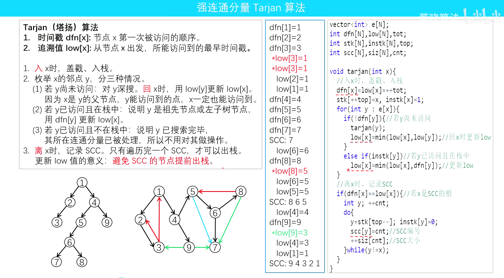

## 简介
在编译优化中, 识别循环结构是非常重要的基础工作, 而强连通分量(SCC)是识别循环的核心工具

对于 SCC 只有鲸书的第七章 141 页有所提及(如果我没看漏的话), 使用 Tarjan 算法, 实话说不容易看懂, 下面这个信息奥赛的老师讲解的很清楚: https://www.bilibili.com/video/BV1SY411M7Tv/?spm_id_from=333.1387.favlist.content.click&vd_source=fd7f17cce2cc926b1a321c3996d115e0.

当然你也可以查些别的资料看, 这里我觉得我没法比上边的视频讲的更好, 不再赘述, 我们直接看 llvm 中 用于构建 SCC 的代码.

## llvm 中 用于构建 SCC 的代码
经过查找在 `llvm/include/llvm/ADT/SCCIterator.h` 文件中实现了非递归实现的 Tarjan 算法构建 SCC:
